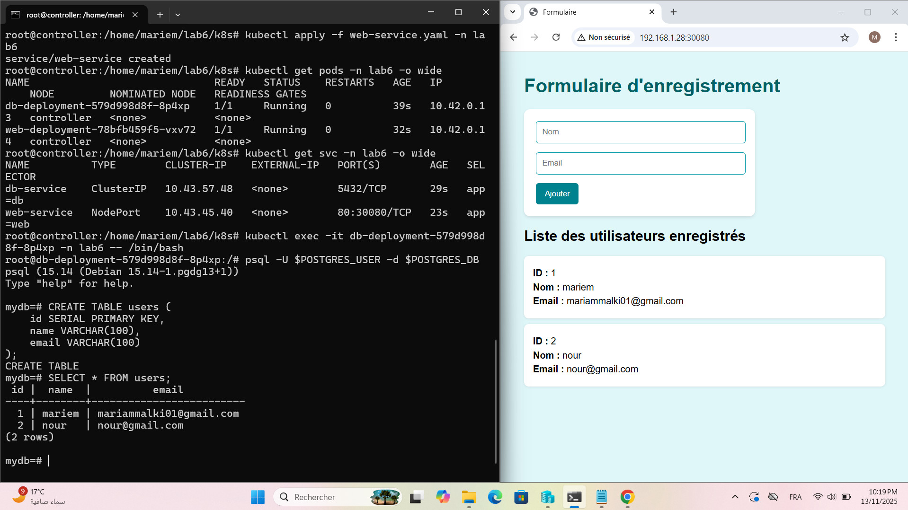

🧩 Lab 6 — Configuration avec ConfigMap et Secret (Flask + PostgreSQL sur K3s)

🎯 Objectif

Ce laboratoire a pour objectif de déployer une application web Flask connectée à une base de données PostgreSQL sur un cluster K3s, en utilisant ConfigMap et Secret pour gérer la configuration et les identifiants de manière sécurisée.

🏗️ Architecture

L’application est composée de deux parties :

Backend (Database) : PostgreSQL

Frontend (Web App) : Flask

Les deux sont déployés dans Kubernetes avec :

Un Deployment et un Service pour chaque composant

Un ConfigMap pour les paramètres de configuration

Un Secret pour les identifiants sensibles

📁 Structure du projet
lab6/
│
├── app/
│   ├── app.py
│   ├── templates/
│   └── requirements.txt
│
├── k8s/
|   |__ namespace.yaml
│   ├── configmap.yaml
│   ├── secret.yaml
│   ├── db-deployment.yaml
│   ├── db-service.yaml
│   ├── web-deployment.yaml
│   └── web-service.yaml
│__docs
└── README.md

⚙️ Étapes de déploiement

🧩 1. Créer le ConfigMap et le Secret

kubectl apply -f k8s/configmap.yaml

kubectl apply -f k8s/secret.yaml

🗄️ 2. Déployer la base de données

kubectl apply -f k8s/db-deployment.yaml

kubectl apply -f k8s/db-service.yaml

🌐 3. Déployer l’application Flask

kubectl apply -f k8s/web-deployment.yaml

kubectl apply -f k8s/web-service.yaml

🔍 Vérifications

📦 Voir les pods :
kubectl get pods

🌐 Voir les services :

kubectl get svc

🪵 Voir les logs de l’application :

kubectl logs -l app=web

🌍 Accès à l’application

Récupère l’adresse IP du nœud :

kubectl get nodes -o wide

Ensuite, ouvre ton navigateur sur :

http://<node-ip>:30081

💡 Le port 30081 correspond au NodePort du service Flask.

🧪 Test de fonctionnement

Ouvre la page web du formulaire.

Entre un nom et un email.

Clique sur Ajouter.

Les données sont enregistrées dans la base PostgreSQL.

Pour vérifier :

kubectl exec -it db pod -- /bin/bash

psql -U $POSTGRES_USER -d $POSTGRES_DB

SELECT * FROM users;

🔐 Sécurité et configuration

Les variables d’environnement (DB_HOST, DB_NAME, etc.) sont stockées dans un ConfigMap.

Les identifiants sensibles (DB_USER, DB_PASSWORD) sont stockés dans un Secret.

Le déploiement Flask lit ces valeurs automatiquement depuis les ressources Kubernetes.

✅ Résultat attendu

L’application Flask démarre correctement.

La connexion à PostgreSQL est établie via les variables du Secret et ConfigMap.

Les données insérées via le formulaire apparaissent dans la base de données.
